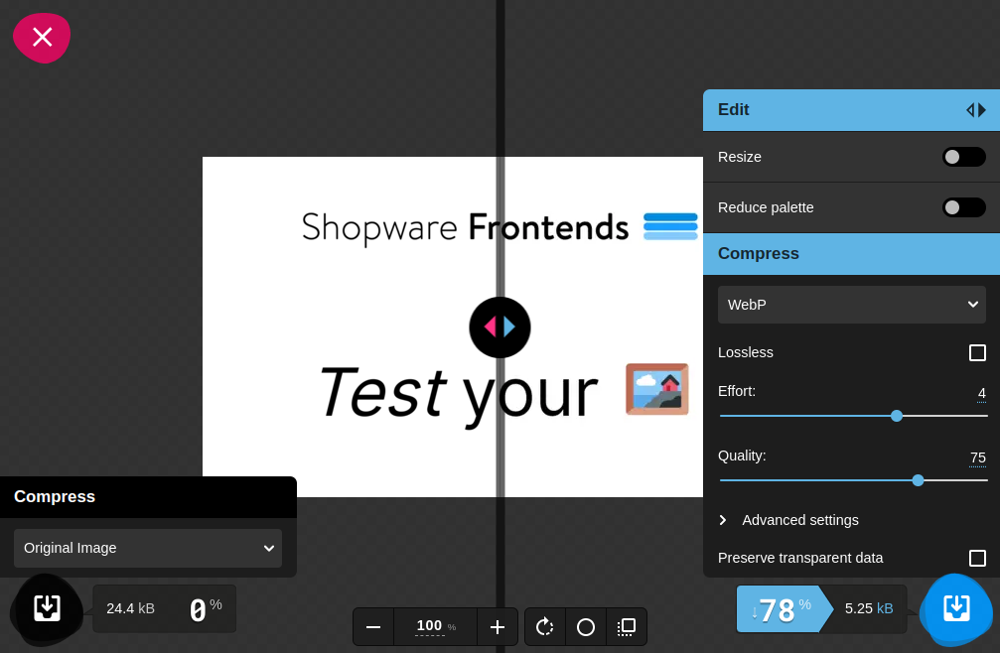

---
head:
  - - meta
    - name: og:title
      content: "Best practices: Images"
  - - meta
    - name: og:description
      content: "Collection of good practices to manage images."
  - - meta
    - name: og:image
      content: "https://frontends-og-image.vercel.app/Best%20practices:%20**Images** 🖼.png?fontSize=110px"
nav:
  position: 30
---

# Images

Best practices for images.

## Optimization

Let's have a look on some good practices to help display images efficiently.

### Image format & Compression

Compression is the first step, relatively easy to achieve in order to reduce loading time by reducing file size, thus saving network traffic for images.

**WebP** is a new format for images, developed by Google, in order to add an alternative for _png_ images, but with lossy compression, enhanced by some new techniques allowing to compress with different level selectively within the same image. As it's become fully supported in all modern browsers - it can be recommended.

You can check how much you can save by using `webp` format instead of others raster-images formats. See how can it help you on [Thumbor](http://thumborize.globo.com/?url=https://frontends-demo.vercel.app).

:::info Test different formats
There are many image formats, which have different advantages, depending on images purposes. Probably you don't need `webp` files for vector images. Sometimes, when the high image quality is important, using lossy formats may not be a good idea. It always depends on the use case.

There are many tools to check different image formats, but the great one is [Squoosh](https://squoosh.app/) which allows you to experiment with images interactively:


:::

### Images hosting on CDN + Image processor

Using Content Delivery Network platforms (CDN) helps to reduce network distance, by serving resources from the closest server for an user.

Although it can be a standalone service, some platforms serves images with additional option of resizing on the fly, or being more general: processing the images, depending on provided query parameter, like `?width=400px`. Thanks to this, `` element is more readable. 

```html

```

Examples of open source image processors which can be used as a middleware to serve processed images:
* [thumbor](https://www.thumbor.org/)
* [lovell/sharp](https://github.com/lovell/sharp)
* [imgproxy/imgproxy](https://github.com/imgproxy/imgproxy)


## Responsive images

Utilize [srcset](https://developer.mozilla.org/en-US/docs/Web/HTML/Element/img#attr-srcset) attribute for `` elements in order to load the image in size what is actually needed at the moment. 
Decide what metric (pixel ratio - DPR or width) is more appropriate for your users when defining breakpoints.

Also, consider using `sizes` attribute which will indicate what image size is best to choose - if your images occupy less than 100% of viewport. The value can be defined in percentage of viewport width (`sizes="80vw"`) or fixed value (`sizes="600px"`) regardless the device size. Read more at [mdn web docs](https://developer.mozilla.org/en-US/docs/Web/HTML/Element/img#attr-sizes).

```html

 <!-- src fallback is set to be mobile first -->
```

If you application serves many image formats and there is a significant part of users with older browsers, you can use [picture](https://developer.mozilla.org/en-US/docs/Web/HTML/Element/picture) element.

In this example, browser will decide which image format is available to serve, otherwise the `` will be picked as a fallback.

```html
 <picture>
    <source
      type="image/avif"
      srcset="
        https://images.swfrontends.com/frontends-unsplash-320.avif 320w, 
        https://images.swfrontends.com/frontends-unsplash-720.avif 720w"
    >
     <source
      type="image/webp"
      srcset="
        https://images.swfrontends.com/frontends-unsplash-320.webp 320w, 
        https://images.swfrontends.com/frontends-unsplash-720.webp 720w"
    >
    
  </picture>
```

## Reduce Cumulative Layout Shift (CLS)

When Images occupy a big amount of space on web pages, they are a common cause of high [CLS](https://web.dev/cls/) scores.

* Always set `width` and `hight` attributes for your `` elements, with values matching size of image source. So even if they are being loaded, the space of layout will be filled out.
* Define CSS style to override `` attributes (there is a moment when image element is available in DOM, and CSS is not loaded yet):
    ```css
    img {
        max-width: 100%;
        height: auto;
    }
    ```
* Try to use low-quality placeholders (based on svg, for example) to avoid having empty blank spaces within the layout:
    <div role="status" class="mt-4 max-w-sm p-4 animate-pulse md:p-6 ">
        <div class="flex items-center justify-center h-32 mb-4 bg-gray-300 rounded dark:bg-gray-700">
            <svg class="w-12 h-12 text-gray-200 dark:text-gray-600" xmlns="http://www.w3.org/2000/svg" aria-hidden="true" fill="currentColor" viewBox="0 0 640 512"><path d="M480 80C480 35.82 515.8 0 560 0C604.2 0 640 35.82 640 80C640 124.2 604.2 160 560 160C515.8 160 480 124.2 480 80zM0 456.1C0 445.6 2.964 435.3 8.551 426.4L225.3 81.01C231.9 70.42 243.5 64 256 64C268.5 64 280.1 70.42 286.8 81.01L412.7 281.7L460.9 202.7C464.1 196.1 472.2 192 480 192C487.8 192 495 196.1 499.1 202.7L631.1 419.1C636.9 428.6 640 439.7 640 450.9C640 484.6 612.6 512 578.9 512H55.91C25.03 512 .0006 486.1 .0006 456.1L0 456.1z"/></svg>
        </div>
    </div>


## Speed up Largest Contentful Paint

"[LCP](https://web.dev/lcp/) element has an image on around three quarters of pages" says the result of [Web research](https://almanac.httparchive.org/en/2021/media#images). Moreover, on 70.6% mobile pages, LCP element has an image. On desktops, the rate is even bigger: 79.4%. So we can assume, that bad LCP scores are based on low image performance. 

* Never use `loading="lazy"` on `` elements if they are part of what an user see first on they viewport (consider editing the attributes for CMS elements in Shopware Experiences).
* Utilize `fetchpriority="high"` on `` also tells the browser, that the asset (LCP resource is prioritized) is important and should be taken care of as fast as possible.


<PageRef page="../framework/images" title="Framework" sub="How to display images served by API" />


## Resources

Collection of useful blog posts and articles about performance related to images.

* https://web.dev/learn/images/
* https://austingil.com/better-html-images/
* https://www.smashingmagazine.com/2023/01/optimizing-image-element-lcp/
* https://web.dev/top-cwv-2023/